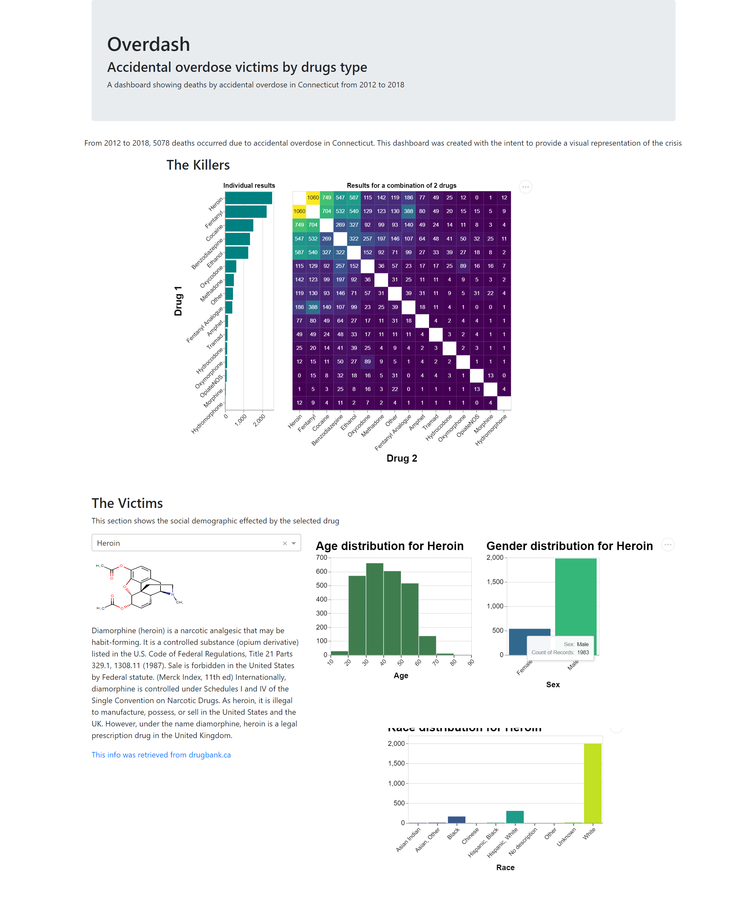

# DSCI_532_Group_113_Overdose_R

[Overdose App(in python)](https://group-113-overdose.herokuapp.com/)

## Description
The landing page of the App starts with some general information of our dataset: 
- the header with "Accidental overdose victims by drugs type" is explaining the main research question this dashboard answers

After the general information, the main body of the app is divided into two parts: "The killers" and "The victims", which allows users to explore the dataset from different aspects.

Firstly, on the left side of "The killers" section, users will see two static graphs. One is the prevalence ranking of drugs found in the deceased people. Another one is the "correlation" map of two drugs from this dataset, which counts and compares the occurrences of two-drug combinations in the deaths. On the right side, users can choose one drug to explore next. A brief introduction of this drug will be provided after the choice. This section enables users to have a general idea about different drugs.

Then, in the "victims" part, users can continue exploring the victims of the selected drug. This section demonstrates the age, gender and race distributions of the deceased, which helps people get an insight into the specific drug users.

## Sketch

**Sketch representation**

