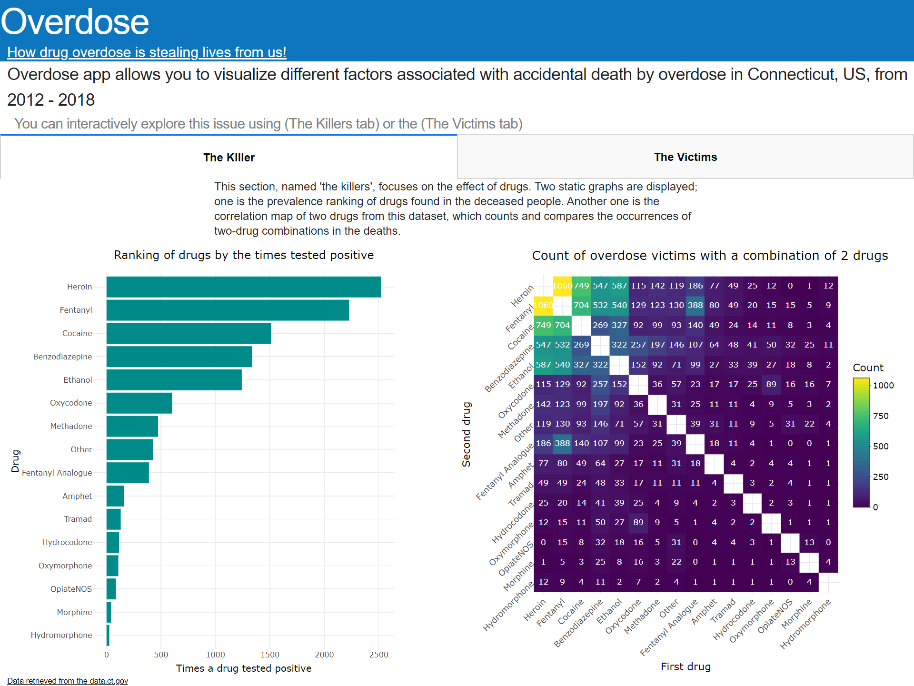
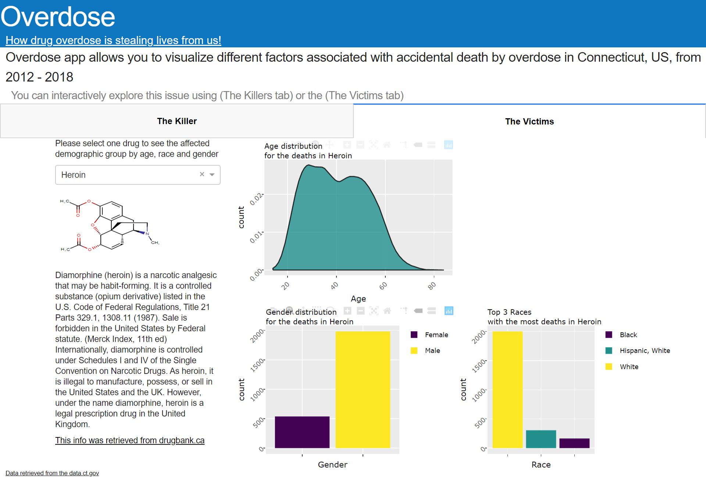

# DSCI_532_Group_113_Overdose_R

[Overdose Dashboard](https://dsci532-milestone4-group113.herokuapp.com/)

## Description
Overdose app allows you to visualize different factors associated with accidental death by overdose.  
You can interactively explore this issue using our two tabs: "The Killers" and "The Victims"

Firstly, in the "killers" section, users will see two static graphs. One is the prevalence ranking of drugs found in the deceased people. Another one is the "correlation" map of two drugs from this dataset, which counts and compares the occurrences of two-drug combinations in the deaths.

Then, in the "victims" part, users can choose one drug to look into next. A brief introduction of this drug will be provided after the choice, which enables users to have a general idea about different drugs. Users can continue exploring the victims of the selected drug with distribution plots of their age, gender and race, which helps people get an insight into these specific drug users.

## Sketch

**Sketch representation**

